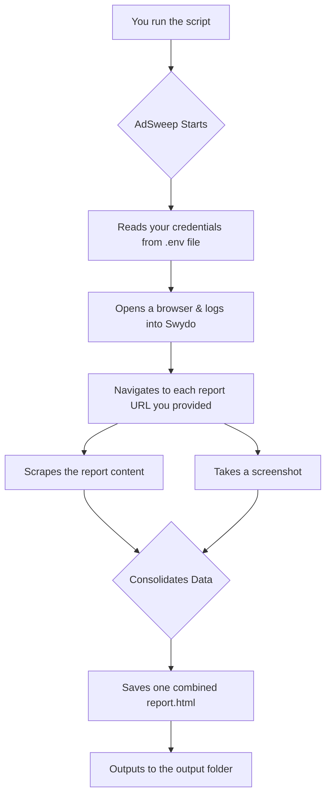

# AdSweep: Automated Swydo Reporting Aggregator

## How It Works

AdSweep uses a browser automation tool to mimic the steps a human would take. The entire process is automated:



## Features

*   **Automated Login:** No need to enter your username and password every time.
*   **Multi-Report Scraping:** Pulls data from as many reports as you need.
*   **Consolidated HTML Output:** Generates a single, easy-to-view HTML file.
*   **Verification Screenshots:** Saves images of the reports as it scrapes them.
*   **Server-Friendly:** Runs in headless mode, so it doesn't need a screen.

## Getting Started in 3 Steps

**Prerequisites:** You'll need [Git](https://git-scm.com/), [Python](https://www.python.org/downloads/) (3.8+), and [Poetry](https://python-poetry.org/docs/#installation).

### 1. Clone the Project
```bash
git clone https://github.com/your-username/adsweep.git
cd adsweep
```

### 2. Configure Your Credentials
AdSweep needs your Swydo login details and the list of reports to scrape.

```bash
# 1. Copy the example environment file
cp .env.example .env

# 2. Open the .env file in a text editor and add your details
```
**Your `.env` file should look like this:**
```ini
# .env
SWYDO_EMAIL="your_email@example.com"
SWYDO_PASSWORD="your_secret_password"

# Add the full URLs of the Swydo reports, separated by a comma
REPORT_URLS="https://app.swydo.com/reports/12345,https://app.swydo.com/reports/67890"
```

### 3. Install and Run
This one command installs all dependencies, downloads the necessary browser, and runs the scraper.

```bash
make bootstrap && make run
```

The final `report.html` and screenshots will be saved in the `output/` directory.

---

## Development & Manual Usage

The project uses a `Makefile` to simplify common tasks.

*   **To install dependencies:**
    ```bash
    make bootstrap
    # This runs: poetry install && poetry run playwright install
    ```
*   **To run the scraper:**
    ```bash
    make run
    # This runs: poetry run python -m adsweep.main
    ```
*   **To open a developer shell:**
    ```bash
    make shell
    # This runs: poetry shell
    ```
*   **To see all commands:**
    ```bash
    make help
    ```

## Contributing

Contributions are welcome! Please feel free to submit a pull request or open an issue.

## License

This project is licensed under the MIT License - see the [LICENSE](LICENSE) file for details.
